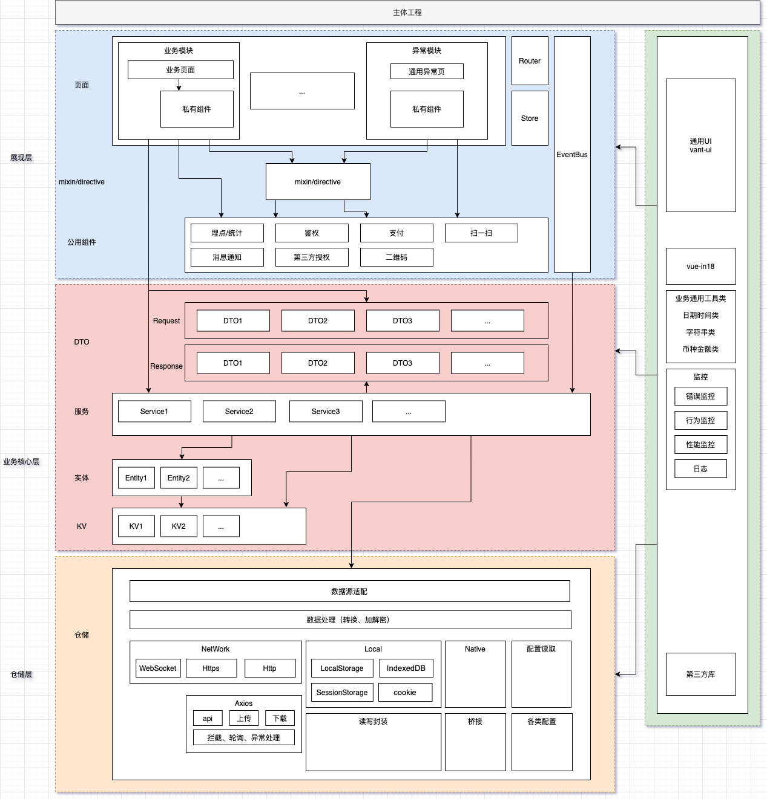

>  模板基于 vue-cli4 和 Vant-ui 搭建，进行大型 H5 项目开发最佳实践方案

## 安装

```sh
# 克隆项目
git clone git@github.com:FreeDemons/vue-basic-h5.git

# 进入项目目录
cd vue-basic-h5

# 安装依赖
npm install

# 建议不要用 cnpm 安装 会有各种诡异的bug 可以通过如下操作解决 npm 下载速度慢的问题
npm install --registry=https://registry.npm.taobao.org

# 本地开发 启动项目
npm run serve
```

## 架构图如下



## 主要功能

# 版本发布及工具

- [x] 1、doc
- [x] 2、mock
- [ ] 3、deploy
- [ ] 4、环境切换
- [ ] 5、提交前代码检查
- [ ] 6、提交前圈复杂度检查
- [ ] 7、提交前文件命名检查
- [ ] 8、提交前文件目录检查
- [ ] 9、提交前重要版本号检查
- [ ] 10、提交前commit-msg检查
- [ ] 11、cli-plugin-eslint 封装eslint需要的包
- [ ] 12、cli-plugin-webpack 封装webpack需要的包
- [ ] 13、cli-plugin-unitest 封装unitest需要的包

# 展现层

- [ ] 1、统一Loading 封装
- [ ] 2、异常页面汇总 封装
- [ ] 3、鉴权 封装
- [ ] 4、国际化 封装

# 业务核心层


# 仓储层

- [ ] 1、Axios 底层封装
- [ ] 2、Native 底层封装
- [ ] 3、Local 底层封装

# 工具类

- [ ] 1、日期时间格式化
- [ ] 2、字符串常用格式化
- [ ] 3、金额币种格式化

# 监控

- [ ] 1、性能监控
- [ ] 2、错误监控
- [ ] 3、行为监控
- [ ] 4、上报优化

## vscode插件

```text
1、Abracadabra, refactor this! 重构插件
2、Debugger for Chrome 调试插件
3、ESlint 代码检查插件
4、markdownlint 文档检查插件
5、Node TDD 测试驱动开发插件
6、npm
7、npm Intellisense
8、Path Intellisense
9、REST Client
10、Vetur
11、vscode-icons
12、EditorConfig for VS Code
13、Code Runner
```
